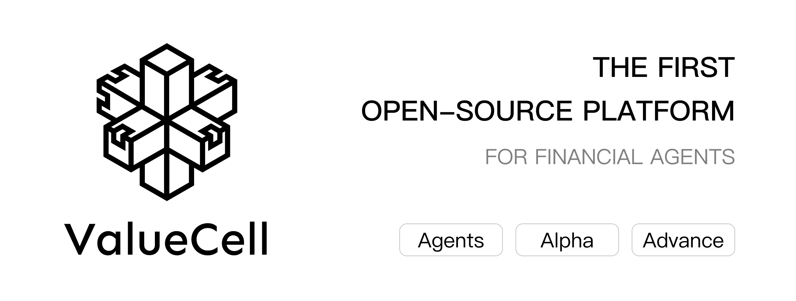
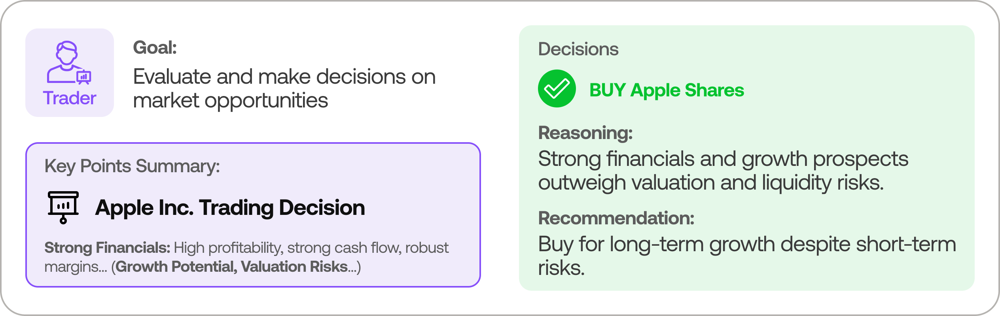

<p align="center">
  
</p>

<div align="center" style="line-height: 1;">
    <a href="https://www.python.org/downloads" target="_blank">
        </a>
    <a href=".LICENSE" target="_blank">
        </a>  
    <br>
    <a href="https://discord.com/invite/84Kex3GGAh" target="_blank">
        </a>
    <a href="https://twitter.com/intent/follow?screen_name=valuecell" target="_blank">
        </a>
    <a href="https://www.linkedin.com/company/langgenius/" target="_blank">
        </a>
    <a href="https://www.facebook.com/people/ValueCell/61581410516790/" target="_blank">
        </a>
</div>

<div align="center">
  <a href="README.md" style="color: gray;">English</a>
  <a href="README.zh.md" style="color: auto;">中文</a>
</div>


# ValueCell
ValueCell is a community-driven, multi-agent platform for financial applications.


## TradingAgents Framework

TradingAgents is a multi-agent trading framework that mirrors the dynamics of real-world trading firms. By deploying specialized LLM-powered agents: from fundamental analysts, sentiment experts, and technical analysts, to trader, risk management team, the platform collaboratively evaluates market conditions and informs trading decisions. Moreover, these agents engage in dynamic discussions to pinpoint the optimal strategy.

<p align="center">
  
</p>

> TradingAgents framework is designed for research purposes. Trading performance may vary based on many factors, including the chosen backbone language models, model temperature, trading periods, the quality of data, and other non-deterministic factors. [It is not intended as financial, investment, or trading advice.](https://tauric.ai/disclaimer/)

Our framework decomposes complex trading tasks into specialized roles. This ensures the system achieves a robust, scalable approach to market analysis and decision-making.

### Analyst Team
- Fundamentals Analyst: Evaluates company financials and performance metrics, identifying intrinsic values and potential red flags.
- Sentiment Analyst: Analyzes social media and public sentiment using sentiment scoring algorithms to gauge short-term market mood.
- News Analyst: Monitors global news and macroeconomic indicators, interpreting the impact of events on market conditions.
- Technical Analyst: Utilizes technical indicators (like MACD and RSI) to detect trading patterns and forecast price movements.

<p align="center">
  
</p>

### Researcher Team
- Comprises both bullish and bearish researchers who critically assess the insights provided by the Analyst Team. Through structured debates, they balance potential gains against inherent risks.

<p align="center">
  
</p>

### Trader Agent
- Composes reports from the analysts and researchers to make informed trading decisions. It determines the timing and magnitude of trades based on comprehensive market insights.

<p align="center">
  
</p>

### Risk Management and Portfolio Manager
- Continuously evaluates portfolio risk by assessing market volatility, liquidity, and other risk factors. The risk management team evaluates and adjusts trading strategies, providing assessment reports to the Portfolio Manager for final decision.
- The Portfolio Manager approves/rejects the transaction proposal. If approved, the order will be sent to the simulated exchange and executed.

<p align="center">
  
</p>

## Installation and CLI

### Installation

Clone TradingAgents:
```bash
git clone https://github.com/TauricResearch/TradingAgents.git
cd TradingAgents
```

Create a virtual environment in any of your favorite environment managers:
```bash
conda create -n tradingagents python=3.13
conda activate tradingagents
```

Install dependencies:
```bash
pip install -r requirements.txt
```

### Required APIs

You will also need the FinnHub API for financial data. All of our code is implemented with the free tier.
```bash
export FINNHUB_API_KEY=$YOUR_FINNHUB_API_KEY
```

You will need the OpenAI API for all the agents.
```bash
export OPENAI_API_KEY=$YOUR_OPENAI_API_KEY
```

### CLI Usage

You can also try out the CLI directly by running:
```bash
python -m cli.main
```
You will see a screen where you can select your desired tickers, date, LLMs, research depth, etc.

<p align="center">
  
</p>

An interface will appear showing results as they load, letting you track the agent's progress as it runs.

<p align="center">
  
</p>

<p align="center">
  
</p>

## TradingAgents Package

### Implementation Details

We built TradingAgents with LangGraph to ensure flexibility and modularity. We utilize `o1-preview` and `gpt-4o` as our deep thinking and fast thinking LLMs for our experiments. However, for testing purposes, we recommend you use `o4-mini` and `gpt-4.1-mini` to save on costs as our framework makes **lots of** API calls.

### Python Usage

To use TradingAgents inside your code, you can import the `tradingagents` module and initialize a `TradingAgentsGraph()` object. The `.propagate()` function will return a decision. You can run `main.py`, here's also a quick example:

```python
from tradingagents.graph.trading_graph import TradingAgentsGraph
from tradingagents.default_config import DEFAULT_CONFIG

ta = TradingAgentsGraph(debug=True, config=DEFAULT_CONFIG.copy())

# forward propagate
_, decision = ta.propagate("NVDA", "2024-05-10")
print(decision)
```

You can also adjust the default configuration to set your own choice of LLMs, debate rounds, etc.

```python
from tradingagents.graph.trading_graph import TradingAgentsGraph
from tradingagents.default_config import DEFAULT_CONFIG

# Create a custom config
config = DEFAULT_CONFIG.copy()
config["deep_think_llm"] = "gpt-4.1-nano"  # Use a different model
config["quick_think_llm"] = "gpt-4.1-nano"  # Use a different model
config["max_debate_rounds"] = 1  # Increase debate rounds
config["online_tools"] = True # Use online tools or cached data

# Initialize with custom config
ta = TradingAgentsGraph(debug=True, config=config)

# forward propagate
_, decision = ta.propagate("NVDA", "2024-05-10")
print(decision)
```

> For `online_tools`, we recommend enabling them for experimentation, as they provide access to real-time data. The agents' offline tools rely on cached data from our **Tauric TradingDB**, a curated dataset we use for backtesting. We're currently in the process of refining this dataset, and we plan to release it soon alongside our upcoming projects. Stay tuned!

You can view the full list of configurations in `tradingagents/default_config.py`.

## Contributing

We welcome contributions from the community! Whether it's fixing a bug, improving documentation, or suggesting a new feature, your input helps make this project better. If you are interested in this line of research, please consider joining our open-source financial AI research community [Tauric Research](https://tauric.ai/).


<div align="center">
<a href="https://www.star-history.com/#TauricResearch/TradingAgents&Date">
 <picture>
   <source media="(prefers-color-scheme: dark)" srcset="https://api.star-history.com/svg?repos=TauricResearch/TradingAgents&type=Date&theme=dark" />
   <source media="(prefers-color-scheme: light)" srcset="https://api.star-history.com/svg?repos=TauricResearch/TradingAgents&type=Date" />
   
 </picture>
</a>
</div>

<div align="center">